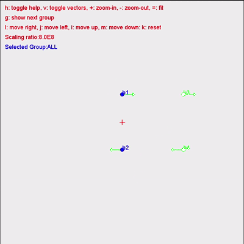

# Physics Simulator TP

Aplicacion Java para simular el movimiento de cuerpos agrupados. El simulador
lee una configuracion en formato JSON, aplica una ley de fuerza a cada grupo y
calcula el estado del sistema paso a paso.

El proyecto sirve para probar modelos fisicos, visualizar los cuerpos y sus
grupos desde una interfaz grafica, y generar resultados automaticamente desde
la linea de comandos.


## Funcionalidades

- Cuerpos estacionarios y cuerpos en movimiento.
- Agrupacion de cuerpos mediante un identificador de grupo.
- Configuracion de grupos, cuerpos y leyes de fuerza usando JSON.
- Interfaz grafica Swing con tablas de grupos y cuerpos.
- Carga de un archivo JSON directamente al iniciar la aplicacion.
- Selector de archivos para cambiar la configuracion desde la GUI.
- Ejecucion paso a paso desde la interfaz grafica.
- Modo batch para ejecutar la simulacion sin abrir una ventana.
- Exportacion de los estados calculados a un archivo JSON.
- Pruebas unitarias JUnit 5 en `tests/`.

## Leyes de fuerza

El proyecto incluye estas leyes:

- `nlug`: ley de gravitacion universal de Newton.
- `mtfp`: movimiento hacia un punto fijo.
- `nf`: ausencia de fuerza.

Cada grupo puede tener su propia ley de fuerza. La clase `PhysicsSimulator`
mantiene los grupos, avanza la simulacion y notifica los cambios a la
interfaz mediante observadores.

## Requisitos

- JDK 21 o una version compatible.
- Las dependencias incluidas en `lib/`:
  - `commons-cli-1.4.jar`: lectura de las opciones de la linea de comandos.
  - `json.jar`: lectura y escritura de los archivos JSON.

Las dependencias son necesarias porque `org.json` y
`org.apache.commons.cli` no forman parte de Java. El classpath debe incluir
`lib/*` al compilar y al ejecutar.

## Estructura del proyecto

- `src/`: codigo fuente de la aplicacion.
- `src/simulator/model/`: cuerpos, grupos, leyes de fuerza y simulador.
- `src/simulator/control/`: controlador que conecta el modelo con la vista.
- `src/simulator/launcher/`: clase principal y lectura de opciones.
- `src/extra/jtable/`: interfaz grafica, tablas y controles Swing.
- `src/simulator/view/`: componentes relacionados con la visualizacion.
- `tests/`: pruebas unitarias.
- `bin/`: clases compiladas.
- `lib/`: librerias externas.
- `resources/examples/input/`: ejemplos de configuraciones de entrada.
- `resources/examples/expected_output/`: resultados esperados de ejemplo.

## Compilar

Los archivos fuente del proyecto estan guardados con codificacion Windows
`cp1252`. Por eso se debe usar `-encoding cp1252` al compilar:

```cmd
mkdir bin
dir /s /b src\*.java > sources.txt
javac -encoding cp1252 -cp "lib/*" -d bin @sources.txt
```

## Ejecutar la interfaz grafica

El comando de ejecucion presupone que el proyecto ya se ha compilado y que la
terminal esta situada en la carpeta raiz. Si acabas de abrir el proyecto o has
modificado el codigo, ejecuta primero la seccion [Compilar](#compilar).

Despues, inicia la GUI cargando automaticamente un archivo JSON:

```cmd
java -cp "bin;lib/*" simulator.launcher.Main -i resources/examples/input/ex1.json
```

La opcion `-i` indica el archivo de entrada. La aplicacion crea la ventana y
carga ese archivo antes de mostrar los grupos y los cuerpos en las tablas.
Tambien se puede pulsar el boton de abrir archivo para cargar otra
configuracion desde la interfaz.

## Ejecutar en modo batch

El modo batch no abre la interfaz. Ejecuta un numero determinado de pasos y
guarda todos los estados en un archivo JSON:

```cmd
java -cp "bin;lib/*" simulator.launcher.Main -m batch -i resources/examples/input/ex1.json -o resultado.json -s 3 -dt 1000 -fl nlug
```

En este ejemplo:

- `-m batch` selecciona el modo sin interfaz.
- `-i` selecciona la entrada.
- `-o resultado.json` indica el archivo de salida.
- `-s 3` ejecuta tres pasos.
- `-dt 1000` establece el tiempo de cada paso.
- `-fl nlug` selecciona la ley de Newton como ley predeterminada.

## Opciones de ejecucion

| Opcion | Descripcion | Valor predeterminado |
|---|---|---|
| `-i`, `--input` | Archivo JSON de entrada. | Ninguno en batch |
| `-o`, `--output` | Archivo JSON de salida en modo batch. | Salida estandar |
| `-s`, `--steps` | Numero de pasos de simulacion. | `150` |
| `-dt`, `--delta-time` | Tiempo simulado por paso. | `2500` |
| `-fl`, `--force-laws` | Ley predeterminada: `nlug`, `mtfp` o `nf`. | `nlug` |
| `-m`, `--mode` | Modo de ejecucion: `gui` o `batch`. | `gui` |
| `-h`, `--help` | Muestra la ayuda. | - |

Para consultar todas las opciones:

```cmd
java -cp "bin;lib/*" simulator.launcher.Main -h
```

## Formato del archivo JSON

El archivo de entrada contiene los grupos, las leyes y los cuerpos. Cada
cuerpo indica su tipo y sus datos:

```json
{
  "groups": ["g1"],
  "laws": [
    {
      "id": "g1",
      "laws": {
        "type": "mtfp",
        "data": {}
      }
    }
  ],
  "bodies": []
}
```

Los ejemplos completos estan en `resources/examples/input/`, especialmente
`ex1.json`, `ex2.json`, `ex3.json` y `ex4.json`.

## Funcion de las tablas de la GUI

`InfoTable` es un componente grafico reutilizable que muestra una tabla dentro
de un panel con titulo y barras de desplazamiento. Se utiliza para presentar
la informacion de grupos y cuerpos de forma ordenada.

- `GroupsTableModel` muestra los grupos, sus leyes y sus cuerpos.
- `BodiesTableModel` muestra el identificador, grupo, masa, velocidad,
  posicion y fuerza de cada cuerpo.
- `Controller` carga los datos y coordina las acciones de la interfaz con el
  modelo fisico.

## Ejecutar desde Eclipse o VS Code

El proyecto incluye `.project` y `.classpath` para Eclipse. La clase
principal es:

```text
simulator.launcher.Main
```

En VS Code se debe abrir la carpeta raiz del proyecto y tener instalada la
extension **Extension Pack for Java** (Microsoft), que incluye el
Language Server basado en Eclipse JDT y sabe leer `.project`/`.classpath`.

**Importante:** si ademas tienes instalada la extension **Java** de Oracle
Corporation (Oracle Java SE Language Server), desactivala. Las dos
extensiones compiten por el mismo lenguaje y, si gana la de Oracle
(basada en NetBeans), no interpreta el `.classpath` de Eclipse — aparecen
errores como `package org.json does not exist` o
`package org.apache.commons.cli does not exist` aunque el proyecto
compile bien por terminal.

Si tras desactivar la extension de Oracle siguen apareciendo errores:

1. `Ctrl+Shift+P` -> `Java: Clean Java Language Server Workspace` -> "Restart and delete".
2. Espera a que la barra de estado termine de indexar el proyecto.

La comprobacion independiente desde terminal es:

```cmd
javac -encoding cp1252 -cp "lib/*" -d bin @sources.txt
```